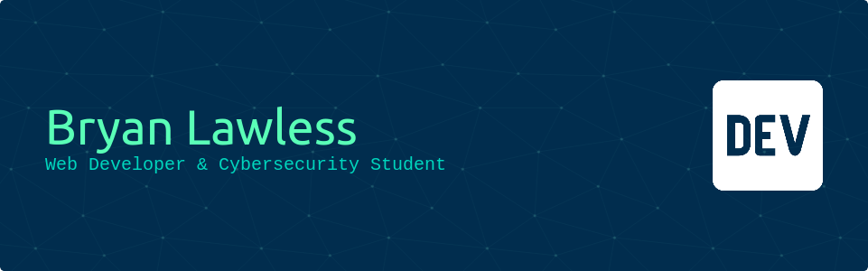

<h2>👋 Hey there! </h2>

I'm a web developer with over five years of experience.

I started in 2017 with HTML and CSS, making simple static web pages. A few months later I started learning Javascript and PHP. After creating a few projects, I moved to learning NodeJS and Golang. I am currently experimenting with React Native in order to bring my next project to life.

My goal with my projects is to give power back to the user, and making things that will help people.

 

<h2>📜 About Me</h2>

- 🌲 A `18` year old male from Colorado, USA 🇺🇸
- 📚 Learning `React Native`
- ⭐ Favorite programming langauges:
    - Golang
    - Python
    - Typescript
- 🏓 Hobbies:
    - Mountain Biking
    - Tennis
    - Soccer
- 📬 Contacts:
    - Discord: `@thelawlessdev`

 
 
 <h2>🧰 Skill Set - Tools - OS</h2>
 
                    

 

<h2>🚧 Current Projects</h2>

    
    

<h2>🪙 Certifications</h2>
<table>
  <tr>
    <td></td>
    <td></td>
  </tr>
</table>

 

<h2>📊 Github Stats</h2>

  
  
  

